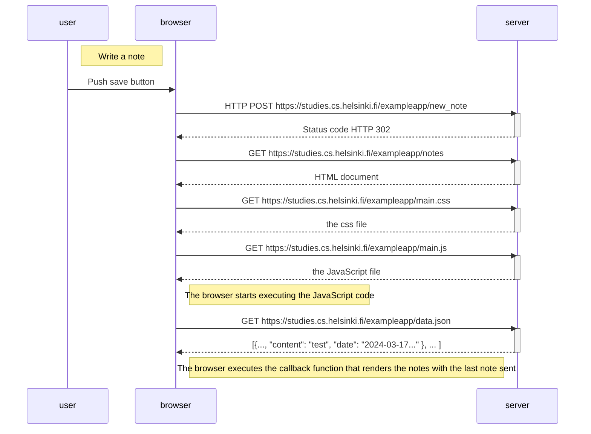
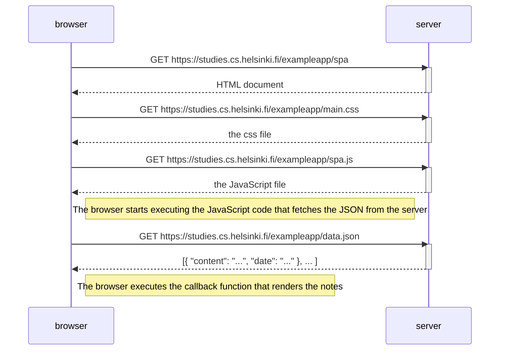
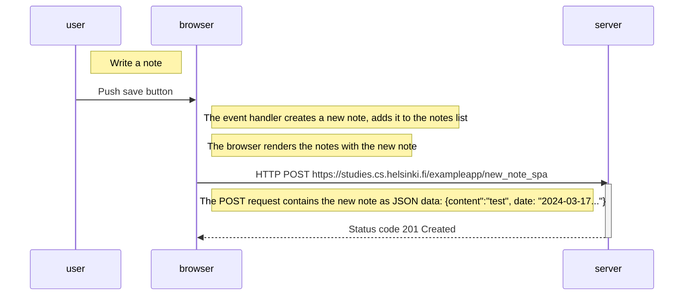

# Part 0 

 In this part, we will familiarize ourselves with the practicalities of taking the course. After that, we will have an overview of the basics of web development and also talk about the advances in web application development during the last few decades.

# Exercice 0.4: New note diagram

 Sequence diagram depicting the situation where the user creates a new note on the page https://studies.cs.helsinki.fi/exampleapp/notes by writing something into the text field and clicking the Save button.

# Exercice 0.5: Single page app diagram

Sequence diagram depicting the situation where the user goes to the single-page app version of the notes app at https://studies.cs.helsinki.fi/exampleapp/spa.

# Exercice 0.6: New note in Single page app diagram

 Sequence diagram depicting the situation where the user goes to the single-page app version of the notes app at https://studies.cs.helsinki.fi/exampleapp/spa.

