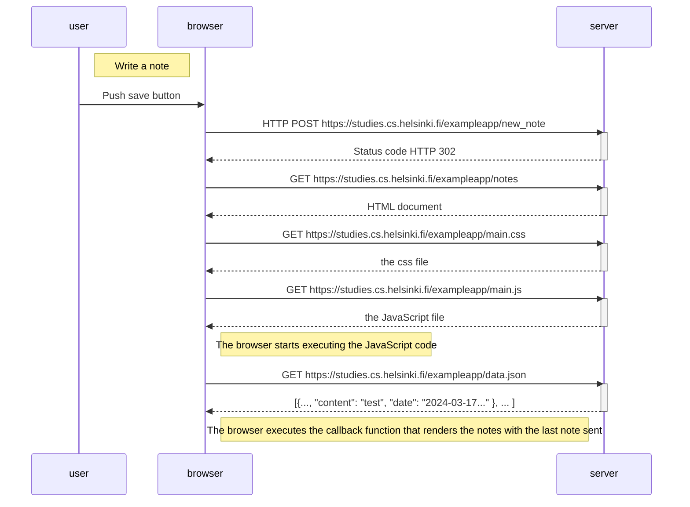

# Exercice 0.4

```mermaid
    sequenceDiagram
        participant user
        participant browser
        participant server
        
        Note right of user: Write a note

        user ->> browser: Push save button
        browser->>server: HTTP POST https://studies.cs.helsinki.fi/exampleapp/new_note
        activate server
        server-->>browser: Status code HTTP 302
        deactivate server

        browser->>server: GET https://studies.cs.helsinki.fi/exampleapp/notes
        activate server
        server-->>browser: HTML document
        deactivate server

        browser->>server: GET https://studies.cs.helsinki.fi/exampleapp/main.css
        activate server
        server-->>browser: the css file
        deactivate server

        browser->>server: GET https://studies.cs.helsinki.fi/exampleapp/main.js
        activate server
        server-->>browser: the JavaScript file
        deactivate server

        Note right of browser: The browser starts executing the JavaScript code

        browser->>server: GET https://studies.cs.helsinki.fi/exampleapp/data.json
        activate server
        server-->>browser: [{..., "content": "test", "date": "2024-03-17..." }, ... ]
        deactivate server

        Note right of browser: The browser executes the callback function that renders the notes with the last note sent
```
